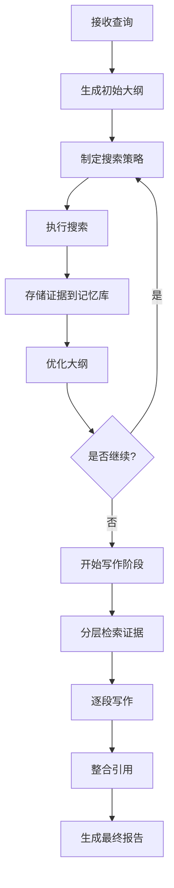

# WebWeaver 架构设计文档

## 1. 核心架构概述

WebWeaver采用双智能体协作架构，模拟人类研究过程，通过动态规划和大纲优化来生成高质量的研究报告。

### 1.1 整体架构图

```
┌─────────────────────────────────────────────────────────────────┐
│                        WebWeaver 系统架构                        │
├─────────────────────────────────────────────────────────────────┤
│  ┌─────────────────┐    ┌─────────────────┐    ┌──────────────┐ │
│  │  Planner Agent  │    │  Writer Agent   │    │ Memory Bank  │ │
│  │                 │    │                 │    │              │ │
│  │ • 动态大纲生成   │    │ • 分层检索      │    │ • 证据存储   │ │
│  │ • 证据获取策略   │    │ • 逐段写作      │    │ • 引用管理   │ │
│  │ • 研究循环管理   │    │ • 引用整合      │    │ • 分层索引   │ │
│  └─────────────────┘    └─────────────────┘    └──────────────┘ │
│           │                       │                       │     │
│           └───────────────────────┼───────────────────────┘     │
│                                   │                             │
│  ┌─────────────────────────────────────────────────────────────┐ │
│  │                    Research Cycle Loop                      │ │
│  │  Query → Think → Search → Outline → Optimize → Write       │ │
│  └─────────────────────────────────────────────────────────────┘ │
└─────────────────────────────────────────────────────────────────┘
```

## 2. 核心组件详细设计

### 2.1 Planner Agent (规划智能体)

#### 2.1.1 核心职责
- **动态大纲生成**: 基于查询和已获取证据生成初始大纲
- **大纲优化**: 通过迭代搜索不断优化大纲结构
- **搜索策略**: 根据大纲缺口制定搜索策略
- **循环控制**: 管理研究循环的迭代和终止条件

#### 2.1.2 关键方法
```python
class PlannerAgent:
    def generate_initial_outline(self, query: str) -> Outline
    def optimize_outline(self, current_outline: Outline, new_evidence: List[Evidence]) -> Outline
    def plan_search_strategy(self, outline: Outline) -> List[SearchQuery]
    def should_continue_research(self, outline: Outline, iteration: int) -> bool
```

#### 2.1.3 状态管理
- 当前大纲状态
- 搜索历史记录
- 证据收集进度
- 迭代计数器

### 2.2 Writer Agent (写作智能体)

#### 2.2.1 核心职责
- **分层检索**: 根据大纲各部分需求检索相关证据
- **逐段写作**: 基于检索到的证据逐段生成报告内容
- **引用管理**: 确保每个引用都准确对应到具体证据
- **质量控制**: 检查生成内容的一致性和准确性

#### 2.2.2 关键方法
```python
class WriterAgent:
    def retrieve_evidence_for_section(self, section: Section, memory_bank: MemoryBank) -> List[Evidence]
    def write_section(self, section: Section, evidence: List[Evidence]) -> WrittenSection
    def integrate_citations(self, content: str, evidence: List[Evidence]) -> str
    def validate_citations(self, content: str) -> bool
```

#### 2.2.3 写作流程
1. 接收最终大纲
2. 为每个章节检索相关证据
3. 逐段生成内容并整合引用
4. 质量检查和优化

### 2.3 Memory Bank (记忆库)

#### 2.3.1 核心职责
- **证据存储**: 存储搜索到的原始证据和摘要
- **分层索引**: 支持基于内容、主题、来源的分层检索
- **引用管理**: 维护证据ID与内容的映射关系
- **去重处理**: 避免重复存储相同证据

#### 2.3.2 数据结构
```python
class Evidence:
    id: str
    content: str
    summary: str
    source: str
    url: str
    relevance_score: float
    metadata: Dict[str, Any]

class MemoryBank:
    evidence_store: Dict[str, Evidence]
    content_index: ContentIndex
    source_index: SourceIndex
    topic_index: TopicIndex
```

## 3. 研究循环设计

### 3.1 循环流程



### 3.2 关键决策点

#### 3.2.1 大纲优化条件
- 新证据与当前大纲的匹配度
- 大纲覆盖度是否达到阈值
- 迭代次数是否超过限制

#### 3.2.2 搜索策略调整
- 基于大纲缺口确定搜索关键词
- 根据证据质量调整搜索深度
- 平衡搜索广度与深度

## 4. 技术实现要点

### 4.1 提示词工程
- 大纲生成提示词模板
- 搜索策略制定提示词
- 写作质量评估提示词

### 4.2 检索优化
- 语义相似度计算
- 多模态证据处理
- 引用准确性验证

### 4.3 质量控制
- 内容一致性检查
- 引用准确性验证
- 逻辑结构完整性

## 5. 性能优化策略

### 5.1 并行处理
- 多线程搜索执行
- 异步证据处理
- 并行章节写作

### 5.2 缓存机制
- 搜索结果缓存
- 证据摘要缓存
- 大纲状态缓存

### 5.3 资源管理
- 内存使用优化
- 网络请求限制
- 计算资源分配

## 6. 扩展性设计

### 6.1 插件架构
- 可插拔搜索引擎
- 可扩展写作策略
- 自定义评估指标

### 6.2 多模态支持
- 图像证据处理
- 视频内容分析
- 音频信息提取

### 6.3 分布式部署
- 微服务架构
- 负载均衡
- 容错机制
